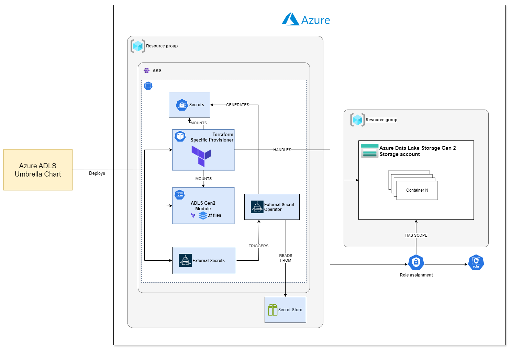

 

    

 

Designed by [Agile Lab](https://www.agilelab.it/), Witboost is a versatile platform that addresses a wide range of sophisticated data engineering challenges. It enables businesses to discover, enhance, and productize their data, fostering the creation of automated data platforms that adhere to the highest standards of data governance. Want to know more about Witboost? Check it out [here](https://www.agilelab.it/witboost) or [contact us!](https://www.agilelab.it/contacts)

This repository is part of our [Starter Kit](https://github.com/agile-lab-dev/witboost-starter-kit) meant to showcase Witboost's integration capabilities and provide a "batteries-included" product.

# Azure ADLS Umbrella Chart

- [Overview](#overview)
- [Configuring](#configuring)
- [Deploying](#deploying)

## Overview

This project implements a Helm chart that deploys the [Terraform Specific Provisioner](https://github.com/agile-lab-dev/witboost-terraform-scaffold) along with the Azure ADLS modules.

## Configuring

Please refer to the individual charts for the configuration.

## Maintainers

| Name | Email | Url |
| ---- | ------ | --- |
| Agile Lab |  | <https://www.agilelab.it> |

## Requirements

| Repository | Name | Version |
|------------|------|---------|
| https://gitlab.com/api/v4/projects/44077776/packages/helm/devel | terraform-specific-provisioner | 0.0.0-SNAPSHOT-6303f3dfc2.wit-2108-add-princip |
| https://gitlab.com/api/v4/projects/55880667/packages/helm/devel | adls-gen2 | 0.0.0-SNAPSHOT-9735ae76dd.wip |
## Values

| Key | Type | Description | Default |
|-----|------|---------|-------------|
| adls-gen2.enabled | bool | Include the TF module to create the Storage Account | `true` |
| adls-gen2.fullnameOverride | string |  | `"adls-gen2"` |
| adls-gen2.state | object | Terraform Remote State configuration | `{"container_name":"","resource_group_name":"","storage_account_name":""}` |
| adls-gen2.state.container_name | string | The Name of the Storage Container within the Storage Account | `""` |
| adls-gen2.state.resource_group_name | string | The Name of the Resource Group in which the Storage Account exists | `""` |
| adls-gen2.state.storage_account_name | string | The Name of the Storage Account | `""` |
| globals.externalSecrets.refreshInterval | string | Secrets refresh interval | `"15m"` |
| globals.externalSecrets.refs | object | Each field represent the name of the secret in the remote secret manager | Map of fields |
| globals.externalSecrets.secretStore | string | Secret store installed in the cluster | `"fake"` |
| terraform-specific-provisioner.configOverride | string | This configuration allows you to override the application.conf file | `"datameshProvisioner {\n  networking {\n    httpServer {\n      port: 8083\n      interface: \"0.0.0.0\"\n    }\n  }\n  terraform {\n    \"urn:dmb:utm:azure-storage-adlsgen2-template:0.0.0\" {\n      repositoryPath: \"/tf/adls-gen2\"\n      descriptorToVariablesMapping: {\n        dp_domain = \"$.dataProduct.components[?(@.id == '{{componentIdToProvision}}')].specific.component.dpDomain\"\n        dp_name_major_version = \"$.dataProduct.components[?(@.id == '{{componentIdToProvision}}')].specific.component.dpNameMajorVersion\"\n        component_name = \"$.dataProduct.components[?(@.id == '{{componentIdToProvision}}')].specific.component.name\"\n        resource_group = \"$.dataProduct.components[?(@.id == '{{componentIdToProvision}}')].specific.resourceGroup\"\n        environment = \"$.dataProduct.environment\"\n        account_tier = \"$.dataProduct.components[?(@.id == '{{componentIdToProvision}}')].specific.performance\"\n        account_replication_type = \"$.dataProduct.components[?(@.id == '{{componentIdToProvision}}')].specific.redundancy\"\n        access_tier = \"$.dataProduct.components[?(@.id == '{{componentIdToProvision}}')].specific.accessTier\"\n        infrastructure_encryption_enabled = \"$.dataProduct.components[?(@.id == '{{componentIdToProvision}}')].specific.infrastructureEncryptionEnabled\"\n        allow_nested_items_to_be_public = \"$.dataProduct.components[?(@.id == '{{componentIdToProvision}}')].specific.allowNestedItemsToBePublic\"\n        containers = \"$.dataProduct.components[?(@.id == '{{componentIdToProvision}}')].specific.containers\"\n      }\n      principalMappingPlugin {\n           pluginClass: \"it.agilelab.plugin.principalsmapping.impl.azure.AzureMapperFactory\"\n           azure: {\n              tenantId: ${?PRINCIPAL_MAPPING_TENANT_ID}\n              clientId: ${?PRINCIPAL_MAPPING_CLIENT_ID}\n              clientSecret: ${?PRINCIPAL_MAPPING_CLIENT_SECRET}\n           }\n      }\n      backendConfigs: {\n        stateKey = \"key\"\n        configs = {\n          key = \"$.dataProduct.components[?(@.id == '{{componentIdToProvision}}')].specific.state.key\"\n        }\n      }\n    }\n  }\n}\n"` |
| terraform-specific-provisioner.dockerRegistrySecretName | string | Docker Registry Secret name used to access a private repo | `"regcred"` |
| terraform-specific-provisioner.enabled | bool | Switch to enable or disable the Terraform specific provisioner helm chart | `true` |
| terraform-specific-provisioner.extraEnvVars | list | define extra variables to add to the container(s) e.g: extraEnvVars:  - name: FOO     value: "10" | `[{"name":"ARM_CLIENT_ID","valueFrom":{"secretKeyRef":{"key":"ARM_CLIENT_ID","name":"azure-adls-terraform-sp"}}},{"name":"ARM_CLIENT_SECRET","valueFrom":{"secretKeyRef":{"key":"ARM_CLIENT_SECRET","name":"azure-adls-terraform-sp"}}},{"name":"ARM_SUBSCRIPTION_ID","valueFrom":{"secretKeyRef":{"key":"ARM_SUBSCRIPTION_ID","name":"azure-adls-terraform-sp"}}},{"name":"ARM_TENANT_ID","valueFrom":{"secretKeyRef":{"key":"ARM_TENANT_ID","name":"azure-adls-terraform-sp"}}},{"name":"PRINCIPAL_MAPPING_TENANT_ID","valueFrom":{"secretKeyRef":{"key":"PRINCIPAL_MAPPING_TENANT_ID","name":"azure-adls-terraform-sp"}}},{"name":"PRINCIPAL_MAPPING_CLIENT_ID","valueFrom":{"secretKeyRef":{"key":"PRINCIPAL_MAPPING_CLIENT_ID","name":"azure-adls-terraform-sp"}}},{"name":"PRINCIPAL_MAPPING_CLIENT_SECRET","valueFrom":{"secretKeyRef":{"key":"PRINCIPAL_MAPPING_CLIENT_SECRET","name":"azure-adls-terraform-sp"}}}]` |
| terraform-specific-provisioner.extraVolumeMounts | list | define extra volume mounts | `[{"mountPath":"/tf/adls-gen2","name":"adls-gen2"}]` |
| terraform-specific-provisioner.extraVolumes | list | define extra volumes | `[{"configMap":{"defaultMode":420,"name":"adls-gen2"},"name":"adls-gen2"}]` |
| terraform-specific-provisioner.image.pullPolicy | string | The imagePullPolicy for a container and the tag of the image affect when the kubelet attempts to pull (download) the specified image. | `"Always"` |
| terraform-specific-provisioner.image.registry | string | Image repository | `"registry.gitlab.com/agilefactory/witboost.mesh/provisioning/terraform/witboost.mesh.provisioning.terraform.specificprovisioner"` |
| terraform-specific-provisioner.image.tag | string | Image tag | `"to-be-replaced"` |
| terraform-specific-provisioner.labels | object | Allows you to specify common labels | `{}` |
| terraform-specific-provisioner.livenessProbe | object | liveness probe spec | `{}` |
| terraform-specific-provisioner.logbackOverride | object | This configuration allows you to override the logback.xml file | `{}` |
| terraform-specific-provisioner.readinessProbe | object | readiness probe spec | `{}` |
| terraform-specific-provisioner.resources | object | resources spec | `{}` |
| terraform-specific-provisioner.securityContext | object | security context spec | `{"allowPrivilegeEscalation":false,"runAsNonRoot":true,"runAsUser":65535}` |
| terraform-specific-provisioner.serviceAccountName | string | serviceAccount | `nil` |

## Deploying

The module is packaged as an **Helm Chart**. It can be deployed with the `helm` utility.

## License

This project is available under the [Apache License, Version 2.0](https://opensource.org/licenses/Apache-2.0); see [LICENSE](LICENSE) for full details.

## About us

 

    

 

Agile Lab creates value for its Clients in data-intensive environments through customizable solutions to establish performance driven processes, sustainable architectures, and automated platforms driven by data governance best practices.

Since 2014 we have implemented 100+ successful Elite Data Engineering initiatives and used that experience to create Witboost: a technology-agnostic, modular platform, that empowers modern enterprises to discover, elevate and productize their data both in traditional environments and on fully compliant Data mesh architectures.

[Contact us](https://www.agilelab.it/contacts) or follow us on:
- [LinkedIn](https://www.linkedin.com/company/agile-lab/)
- [Instagram](https://www.instagram.com/agilelab_official/)
- [YouTube](https://www.youtube.com/channel/UCTWdhr7_4JmZIpZFhMdLzAA)
- [Twitter](https://twitter.com/agile__lab)
